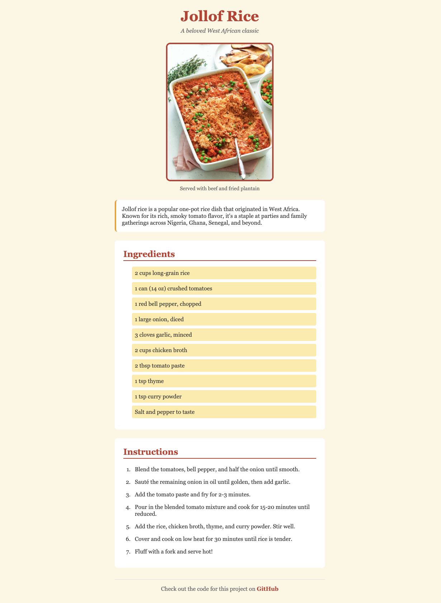

# Assignment 3.1 - Recipe Card

- [Reminders](#reminders)
- [Setup](#setup)
- [Short Response Questions](#short-response-questions)
- [HTML + CSS: Build a Recipe Card](#html--css-build-a-recipe-card)
  - [Example](#example)
  - [Phase 1: HTML Structure (Monday)](#phase-1-html-structure-monday)
  - [Phase 2: Colors \& Typography (Tuesday)](#phase-2-colors--typography-tuesday)
  - [Phase 3: Box Model \& Layout (Wednesday)](#phase-3-box-model--layout-wednesday)
- [CSS Cheatsheet](#css-cheatsheet)
  - [Colors](#colors)
  - [Typography (Text Styling)](#typography-text-styling)
  - [Box Model (Spacing \& Sizing)](#box-model-spacing--sizing)
  - [Layout](#layout)
  - [Interactive States (Pseudo-classes)](#interactive-states-pseudo-classes)

## Reminders

**<details><summary>Asking ChatGPT for Help</summary>**

If you're stuck, you may use ChatGPT to clarify the assignment — but not to solve it for you. To do this, copy the meta-prompt below into ChatGPT along with the assignment question.

> You are acting as a tutor. Your job is to explain what this coding question is asking, clarify confusing wording, and highlight the relevant concepts students need to know — but do not provide the full solution or code that directly answers the question. Instead, focus on rephrasing the problem in simpler terms, identifying what's being tested, and suggesting what steps or thought processes might help. Ask guiding questions to ensure the student is thinking critically. Do not write the final function, algorithm, or code implementation.

Be mindful of your AI usage on assignments. AI can be a great tool to help your learning but it can also be detrimental if you let it do too much of the thinking for you.

</details>

**<details><summary>Be Okay With Being "Provisionally Complete"</summary>**

At Marcy, we will deem an assignment as "complete" if you satisfy the requirements listed below. 

However, we know many of you will feel the urge to hold off on submitting until your assignment feels 100% perfect. That drive for excellence is an asset!

But perfectionism can also get in the way of learning — especially when we need to cover a lot in a short amount of time.

That's why we encourage you to be comfortable with being **"provisionally complete."** This means:

- Submitting your work even if it isn't perfect yet
- Treating submission as a checkpoint, not a finish line
- Committing to return, revise, and improve later

Learning to move forward with provisional completeness will help you make steady progress while still building the habit of continuous improvement.

</details>

## Setup

For guidance on setting up and submitting this assignment, refer to the Marcy lab School Docs How-To guide for [Working with Short Response and Coding Assignments](https://marcylabschool.gitbook.io/marcy-lab-school-docs/how-tos/working-with-assignments#how-to-work-on-assignments).

Starter files have been provided in the `src/` directory:
- `index.html` - Basic HTML structure to build upon
- `index.css` - CSS file with the reset included

**To view your page**: Right-click on `index.html` in VS Code and select "Reveal in Finder/Explorer", then drag the file into Chrome.

Here are some useful commands to remember.

```sh
git checkout -b draft   # switch to the draft branch before starting

git add -A              # add a changed file to the staging area
git commit -m 'message' # create a commit with the changes
git push                # push the new commit to the remote repo
```

When you are finished, create a pull request and tag your instructor for review.

## Short Response Questions

Short response questions can be found in the `src/short-response.md` file. Write your responses directly in that file. Do not forget to complete this part of the assignment.

## HTML + CSS: Build a Recipe Card

Your task is to build a **recipe card** webpage for your favorite recipe. Starter files have been provided with a basic structure and CSS reset.

This assignment is broken into **three phases** that align with what you're learning each day.
1. [HTML Structure](#phase-1-html-structure-monday)
2. [CSS: Colors & Typography](#phase-2-colors--typography-tuesday)
3. [CSS: Box Model & Layout](#phase-3-box-model--layout-wednesday)

If you ever forget a CSS property, check out the [cheat sheet](#css-cheatsheet) below first.

### Example

Below is an example of what your recipe card might look like. **Your recipe and styling should be unique!**



---

### Phase 1: HTML Structure (Monday)

Build out the HTML content inside `<main>`. Your recipe card should include:

- [ ] A `<figure>` containing an `` and `<figcaption>` for the recipe photo
- [ ] A `<p>` element with a short description of the dish
- [ ] A `<section>` with an `<h2>` and an unordered list (`<ul>`) of at least 5 ingredients
- [ ] A `<section>` with an `<h2>` and an ordered list (`<ol>`) of at least 4 instructions
- [ ] An `<a>` element linking to the original recipe source
- [ ] At least 2 different `class` attributes used on your elements
- [ ] At least 1 `id` attribute used on an element

**Tips:**
- Find a recipe image by searching Google Images, right-click, and select "Copy Image Address"
- Don't forget `alt` text on your image!

---

### Phase 2: Colors & Typography (Tuesday)

Add styles to `index.css` to make your recipe card visually appealing:

- [ ] Set a `background-color` on the body
- [ ] Set a text `color` on the body
- [ ] Set a `font-family` on the body (with a fallback like `sans-serif`)
- [ ] Style the headings (`h1`, `h2`) with `color` and `font-size`
- [ ] Style links with a `color`
- [ ] Use at least one class selector (`.classname`) to style a group of elements
- [ ] Use at least one ID selector (`#idname`) to style a specific element

**Tips to try:**
- Use `text-align: center` on the `header` to center your title
- Remove the default underline on links with `text-decoration: none`
- Make links stand out with `font-weight: bold`
- Use `font-style: italic` on a tagline or caption for emphasis
- Try named colors like `midnightblue`, `coral`, `darkgreen`, or browse [this color list](https://www.w3schools.com/cssref/css_colors.php)

---

### Phase 3: Box Model & Layout (Wednesday)

Apply spacing and layout to complete your recipe card:

- [ ] Center the recipe card using `max-width` and `margin: auto` on the body
- [ ] Add `padding` to the body
- [ ] Add `margin` to create space between elements (headings, sections, etc.)
- [ ] Add `padding` to at least one element to create space inside it
- [ ] Add a `border` to at least one element
- [ ] Use `border-radius` to round corners on at least one element
- [ ] Add a `:hover` style to your links

**Tips to try:**
- Use `border-bottom` on `h2` elements to create an underline effect (add `padding-bottom` too for spacing)
- Use `border-left` on the description paragraph for an accent line effect
- Give sections a light `background-color` to make them stand out from the page
- Center your image by putting `text-align: center` on the `figure`
- Control image size by setting `width: 100%` on the image, then use `max-width` on the `figure`
- Remove bullet points from your ingredients list with `list-style: none` on the `ul`
- On `:hover`, try adding a `background-color` to links (you may want to add a little `padding` so the background has room to show)
- Add a `border-top` to the footer to create a visual separator

---

**Debugging Tips:**
- Test your page frequently by refreshing the browser (Cmd+Shift+R or Ctrl+Shift+R for hard refresh)
- Use your browser's Developer Tools (right-click > Inspect) to debug CSS issues
- If a style isn't working, check for typos and missing semicolons!

## CSS Cheatsheet

Here is a reference of the CSS properties we've learned. **You don't need to memorize these!** Use this as a reference while working.

### Colors

| Property | What It Does | Example |
| -------- | ------------ | ------- |
| `color` | Sets text color | `color: midnightblue;` |
| `background` or `background-color` | Sets background color | `background: azure;` |

Color values can be: named colors (`red`, `blue`), hex codes (`#FF5733`), or RGB (`rgb(255, 87, 51)`).

### Typography (Text Styling)

| Property | What It Does | Example |
| -------- | ------------ | ------- |
| `font-family` | Sets the font | `font-family: Arial, sans-serif;` |
| `font-size` | Sets text size (use `rem`!) | `font-size: 1.5rem;` |
| `font-weight` | Sets boldness | `font-weight: bold;` |
| `font-style` | Sets italic | `font-style: italic;` |
| `text-align` | Aligns text | `text-align: center;` |
| `text-decoration` | Adds/removes underlines | `text-decoration: none;` |

### Box Model (Spacing & Sizing)

| Property | What It Does | Example |
| -------- | ------------ | ------- |
| `width` | Sets element width | `width: 300px;` |
| `max-width` | Sets maximum width | `max-width: 600px;` |
| `padding` | Space INSIDE the border | `padding: 20px;` |
| `margin` | Space OUTSIDE the border | `margin: 10px;` |
| `border` | Creates a border (all sides) | `border: 2px solid black;` |
| `border-top`, `border-bottom`, `border-left`, `border-right` | Border on one side | `border-bottom: 2px solid black;` |
| `border-radius` | Rounds corners | `border-radius: 8px;` |

**Shorthand for padding/margin:**
- `padding: 10px;` → all sides
- `padding: 10px 20px;` → top/bottom, left/right

### Layout

| Property | What It Does | Example |
| -------- | ------------ | ------- |
| `margin: auto` | Centers a block element (needs a width!) | `margin: auto;` |
| `list-style` | Styles/removes list bullets | `list-style: none;` |

### Interactive States (Pseudo-classes)

```css
/* When mouse hovers over element */
a:hover {
  background: lightblue;
}
```