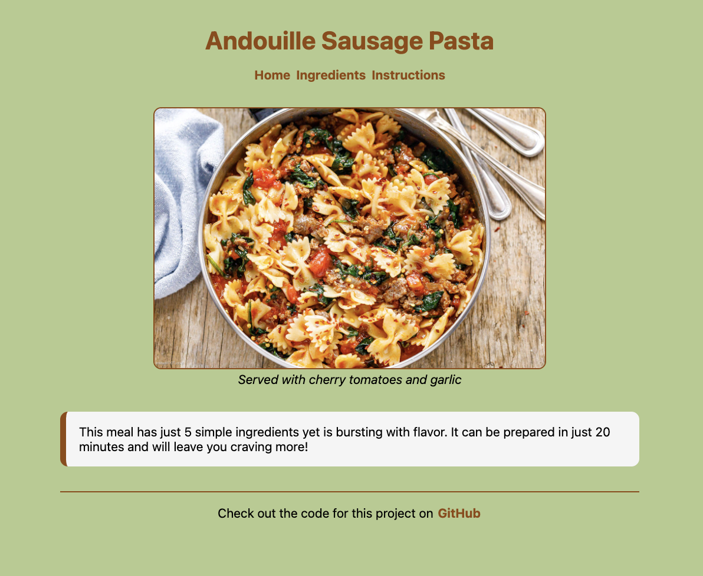
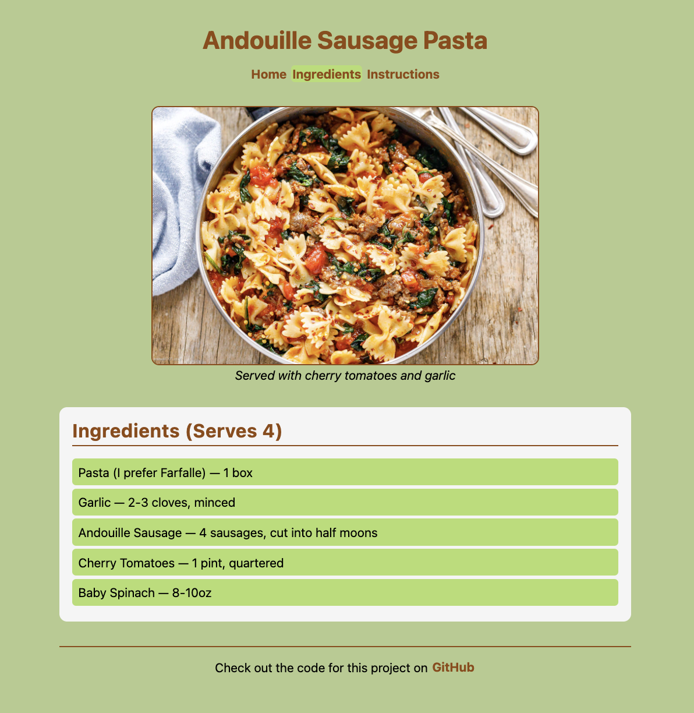
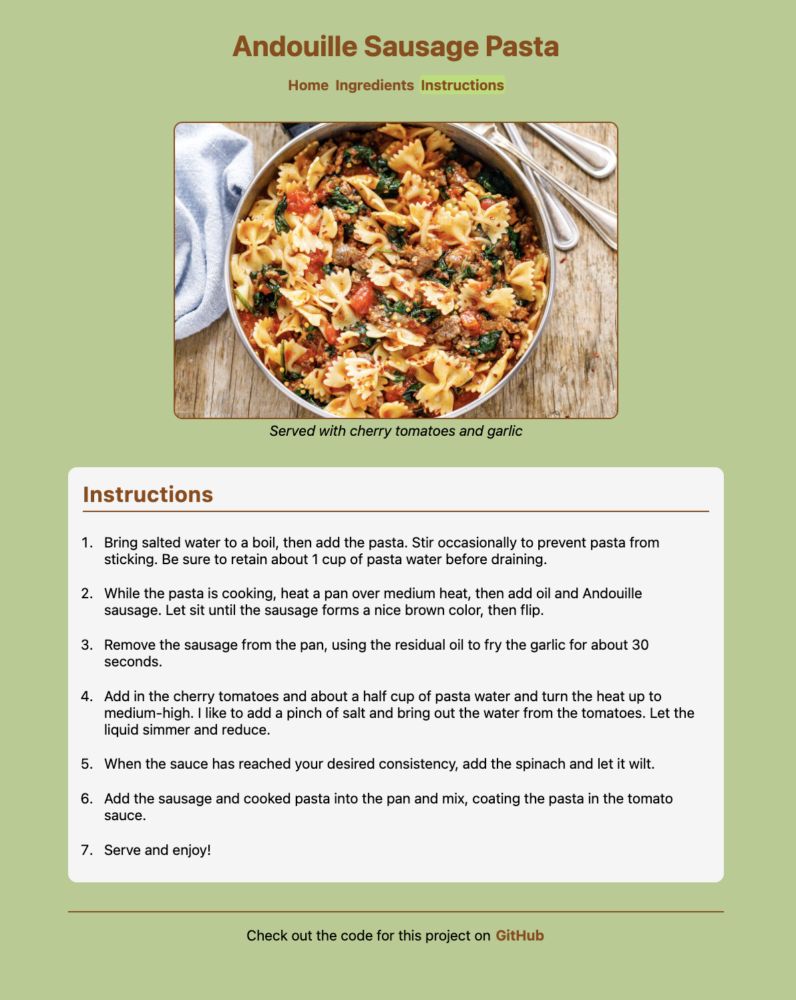

# Assignment 3.1 - Recipe Card

- [Reminders](#reminders)
- [Setup](#setup)
- [Short Response Questions](#short-response-questions)
- [HTML + CSS: Build a Recipe Card](#html--css-build-a-recipe-card)
  - [Target Example](#target-example)
  - [Three Phases](#three-phases)
  - [Methodical Debugging \& Development Tips](#methodical-debugging--development-tips)
- [CSS Cheatsheet](#css-cheatsheet)
  - [Colors](#colors)
  - [Typography (Text Styling)](#typography-text-styling)
  - [CSS Variables](#css-variables)
  - [Box Model (Spacing \& Sizing)](#box-model-spacing--sizing)
  - [Layout](#layout)
  - [Interactive States (Pseudo-classes)](#interactive-states-pseudo-classes)
- [Phase 1: HTML Structure (Monday)](#phase-1-html-structure-monday)
- [Phase 2: Colors \& Typography (Tuesday)](#phase-2-colors--typography-tuesday)
- [Phase 3: Box Model \& Layout (Wednesday)](#phase-3-box-model--layout-wednesday)

## Reminders

**<details><summary>Asking ChatGPT for Help</summary>**

If you're stuck, you may use ChatGPT to clarify the assignment — but not to solve it for you. To do this, copy the meta-prompt below into ChatGPT along with the assignment question.

> You are acting as a tutor. Your job is to explain what this coding question is asking, clarify confusing wording, and highlight the relevant concepts students need to know — but do not provide the full solution or code that directly answers the question. Instead, focus on rephrasing the problem in simpler terms, identifying what's being tested, and suggesting what steps or thought processes might help. Ask guiding questions to ensure the student is thinking critically. Do not write the final function, algorithm, or code implementation.

Be mindful of your AI usage on assignments. AI can be a great tool to help your learning but it can also be detrimental if you let it do too much of the thinking for you.

</details>

**<details><summary>Be Okay With Being "Provisionally Complete"</summary>**

At Marcy, we will deem an assignment as "complete" if you satisfy the requirements listed below. 

However, we know many of you will feel the urge to hold off on submitting until your assignment feels 100% perfect. That drive for excellence is an asset!

But perfectionism can also get in the way of learning — especially when we need to cover a lot in a short amount of time.

That's why we encourage you to be comfortable with being **"provisionally complete."** This means:

- Submitting your work even if it isn't perfect yet
- Treating submission as a checkpoint, not a finish line
- Committing to return, revise, and improve later

Learning to move forward with provisional completeness will help you make steady progress while still building the habit of continuous improvement.

</details>

## Setup

For guidance on setting up and submitting this assignment, refer to the Marcy lab School Docs How-To guide for [Working with Short Response and Coding Assignments](https://marcylabschool.gitbook.io/marcy-lab-school-docs/how-tos/working-with-assignments#how-to-work-on-assignments).

Starter files have been provided in the `src/` directory:
- `index.html`
- `ingredients.html`
- `instructions.html`
- `index.css`

**To view your page**: Drag and drop the `index.html` from the file explorer in VS Code directly into your Chrome Browser tab (do not use Safari — their devtools are terrible. Firefox is okay but not preferred).

Here are some useful commands to remember to get started

```sh
git checkout -b draft   # switch to the draft branch before starting

git add -A              # add a changed file to the staging area
git commit -m 'message' # create a commit with the changes
git push                # push the new commit to the remote repo
```

When you are finished, create a pull request and tag your instructor for review.

## Short Response Questions

Short response questions can be found in the `src/short-response.md` file. Write your responses directly in that file. Do not forget to complete this part of the assignment.

## HTML + CSS: Build a Recipe Card

Your task is to build a **recipe card** webpage for your favorite recipe. Starter files have been provided with a basic structure and CSS reset.

### Target Example

Below is shows what your recipe card should look like. **Your recipe, colors, and typography should be unique but the content, structure, and layout should match this as closely as possible.**

There will be three pages to build that can all use the same stylesheet for a cohesive user experience.


You can view them closer up below:

**<details><summary>Home</summary>**


</details>

**<details><summary>Ingredients</summary>**


</details>

**<details><summary>Instructions</summary>**


</details>


### Three Phases

This assignment is broken into **three phases** that align with what you're learning each day.
1. [HTML Structure](#phase-1-html-structure-monday) — Create the content and structure of all three pages. Connect them with hyperlinks. No styling yet!
2. [CSS: Colors & Typography](#phase-2-colors--typography-tuesday) — Establish the basic color scheme and set your typography.
3. [CSS: Box Model & Layout](#phase-3-box-model--layout-wednesday) — Add padding, spacing, and borders. Adjust content sizing where necessary.

If you ever forget a CSS property, check out the [cheat sheet](#css-cheatsheet) at the end of this README first.

### Methodical Debugging & Development Tips

- Test your page frequently by refreshing the browser (Cmd+Shift+R or Ctrl+Shift+R for hard refresh)
- Use your browser's Developer Tools (right-click > Inspect) to debug CSS issues
- If a style isn't working, check for typos and missing semicolons!

## CSS Cheatsheet

Here is a reference of the CSS properties we've learned. **You don't need to memorize these!** Use this as a reference while working.

### Colors

| Property                           | What It Does          | Example                |
| ---------------------------------- | --------------------- | ---------------------- |
| `color`                            | Sets text color       | `color: midnightblue;` |
| `background` or `background-color` | Sets background color | `background: azure;`   |

Color values can be: named colors (`red`, `blue`), hex codes (`#FF5733`), or RGB (`rgb(255, 87, 51)`).

### Typography (Text Styling)

| Property          | What It Does                | Example                           |
| ----------------- | --------------------------- | --------------------------------- |
| `font-family`     | Sets the font               | `font-family: Arial, sans-serif;` |
| `font-size`       | Sets text size (use `rem`!) | `font-size: 1.5rem;`              |
| `font-weight`     | Sets boldness               | `font-weight: bold;`              |
| `font-style`      | Sets italic                 | `font-style: italic;`             |
| `text-align`      | Aligns text                 | `text-align: center;`             |
| `text-decoration` | Adds/removes underlines     | `text-decoration: none;`          |

### CSS Variables

**CSS Variables** are reusable values you define once and use throughout your CSS. This is helpful for consistent colors, fonts, and easy updates.

**Example:**
```css
:root {
  --color-background: #181818;
  --color-accent: #1db954;
  --color-text: #fff;
  --font-family: Arial, sans-serif;
}
```

**Usage:**
```css
body {
  background: var(--color-background);
  color: var(--color-text);
  font-family: var(--font-family);
}

a:hover {
  color: var(--color-accent);
}
```

Define your variables at the top of your `style.css` inside the `:root` selector, then use them everywhere you reference colors, fonts, or repeated values.

### Box Model (Spacing & Sizing)

| Property                                                     | What It Does                 | Example                           |
| ------------------------------------------------------------ | ---------------------------- | --------------------------------- |
| `width`                                                      | Sets element width           | `width: 300px;`                   |
| `max-width`                                                  | Sets maximum width           | `max-width: 600px;`               |
| `padding`                                                    | Space INSIDE the border      | `padding: 20px;`                  |
| `margin`                                                     | Space OUTSIDE the border     | `margin: 10px;`                   |
| `border`                                                     | Creates a border (all sides) | `border: 2px solid black;`        |
| `border-top`, `border-bottom`, `border-left`, `border-right` | Border on one side           | `border-bottom: 2px solid black;` |
| `border-radius`                                              | Rounds corners               | `border-radius: 8px;`             |

**Shorthand for padding/margin:**
- `padding: 10px;` → all sides
- `padding: 10px 20px;` → top/bottom, left/right

### Layout

| Property       | What It Does                             | Example             |
| -------------- | ---------------------------------------- | ------------------- |
| `margin: auto` | Centers a block element (needs a width!) | `margin: auto;`     |
| `list-style`   | Styles/removes list bullets              | `list-style: none;` |

### Interactive States (Pseudo-classes)

```css
/* When mouse hovers over element */
a:hover {
  background: lightblue;
}
```

---

## Phase 1: HTML Structure (Monday)

**Shared Content**: Take a look at the examples. You'll notice that all three pages have the exact same header and footer content. They also all share the same picture and caption. 

You can build these first in the `index.html` file and then copy them over to your `ingredients.html` and `instructions.html` files.

- [ ] Type `html:5` and hit enter to insert the "boilerplate" structure
- [ ] Update the `title` with the name of your dish
- [ ] In the `<body>` element, add a `header`, `main`, and `footer` element
- [ ] In the `<head>` element, update the `<title>` with the name of your dish.
- [ ] In the `<header>` element, add  a `<h1>` with the name of your dish. 
- [ ] In the `<header>` element, add a `<nav>` containing three hyperlinks (`<a>`) for each of your three pages.
- [ ] In the `<main>` element, add a `<figure>` containing an `` and `<figcaption>` for the recipe photo.
- [ ] In the `<footer>` element, add a hyperlink (`<a>`) element that directs the user to your GitHub profile. It should be nested within a paragraph.

**Home Page Main Content**: Next, build out the HTML content that is unique to the home page:

- [ ] In the `<main>` element, add a `<p>` element with a short description of the dish

**Ingredients Page Main Content**: Next, build out the HTML content that is unique to the ingredients page:

- [ ] In the `<main>` element, add a `<section>` 
- [ ] Inside that `<section>` element, add an `<h2>` with the text content "Ingredients".
- [ ] Below that `<h2>` element, add an unordered list (`<ul>`) of at least 3 ingredients as list items.

**Instructions Page Main Content**: Next, build out the HTML content that is unique to the instructions page:

- [ ] In the `<main>` element, add a `<section>` 
- [ ] Inside that `<section>` element, add an `<h2>` with the text content "Instructions".
- [ ] Below that `<h2>` element, add an ordered list (`<ol>`) of at least 3 instructions as list items.

**Tips:**
- Find a recipe image by searching Google Images, right-click, and select "Copy Image Address"
- Don't forget `alt` text on your image!

---

## Phase 2: Colors & Typography (Tuesday)

Add styles to `index.css` to make your recipe card visually appealing:

- [ ] Set a `background-color` on the body. 
- [ ] Set a text `color` on the body. Make sure that it has good color contrast with the background!
- [ ] Set a `font-family` on the body (with a fallback like `sans-serif`).
- [ ] Use `text-align: center` on the body.
- [ ] Style the headings (`h1`, `h2`) with `color` and `font-size`
- [ ] Style links with a text `color`
- [ ] Remove the default underline on links with `text-decoration: none`
- [ ] Add a hover effect to change the background color of links when hovering over them.
- [ ] Give sections a distinct `background-color` to make them stand out from the page
- [ ] Use `text-align: left` on the sections.
- [ ] Remove bullet points from your ingredients list with `list-style: none` on the `ul`
- [ ] Add `class` attributes and use a class selector (`.classname`) to style the ingredient list items and the instruction list items as groups of elements.
- [ ] Add an `id` attribute and use the ID selector (`#idname`) to style the `figcaption` in italics.

**Tips to try:**
- Google "color picker" and use the tool to choose a main color for your color palette. Then, use [ColorSpace](https://mycolor.space/) to generate a palette of complimentary colors!

---

## Phase 3: Box Model & Layout (Wednesday)

Apply spacing and layout to complete your recipe card:

- [ ] Center the body using `max-width` and `margin: auto`
- [ ] Add a consistent `margin-bottom` to create consistent vertical space between elements (header, main, footer, sections, list items, etc.)
- [ ] Add `margin-right` to create consistent horizontal space between hyperlinks
- [ ] Add `padding` to create space inside of each section, hyperlinks, and list items
- [ ] Add `border` to your recipe image
- [ ] Use `border-bottom` on `h2` elements to create an underline effect (add `padding-bottom` too for spacing)
- [ ] Use `border-left` on the recipe description paragraph for an accent line effect
- [ ] Add a `border-top` to the footer to create a visual separator
- [ ] Use `border-radius` for rounded corners on your sections, list items, hyperlinks, etc.
- [ ] Control image size by setting a `max-width` on the `figure`

