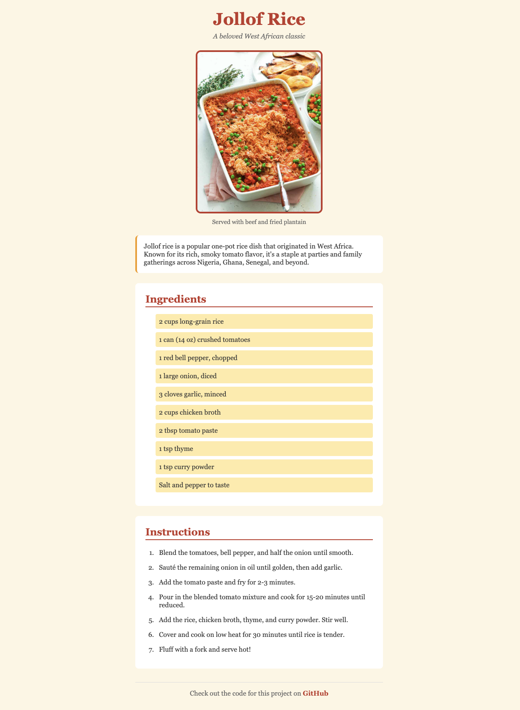

# Assignment 3.1 - Recipe Card

- [Reminders](#reminders)
- [Setup](#setup)
- [Short Response Questions](#short-response-questions)
- [HTML + CSS: Build a Recipe Card](#html--css-build-a-recipe-card)
  - [Example](#example)
  - [Phase 1: HTML Structure (Monday)](#phase-1-html-structure-monday)
  - [Phase 2: Colors \& Typography (Tuesday)](#phase-2-colors--typography-tuesday)
  - [Phase 3: Box Model \& Layout (Wednesday)](#phase-3-box-model--layout-wednesday)
- [CSS Cheatsheet](#css-cheatsheet)
  - [Colors](#colors)
  - [Typography (Text Styling)](#typography-text-styling)
  - [Box Model (Spacing \& Sizing)](#box-model-spacing--sizing)
  - [Layout](#layout)
  - [Interactive States (Pseudo-classes)](#interactive-states-pseudo-classes)

## Reminders

**<details><summary>Asking ChatGPT for Help</summary>**

If you're stuck, you may use ChatGPT to clarify the assignment — but not to solve it for you. To do this, copy the meta-prompt below into ChatGPT along with the assignment question.

> You are acting as a tutor. Your job is to explain what this coding question is asking, clarify confusing wording, and highlight the relevant concepts students need to know — but do not provide the full solution or code that directly answers the question. Instead, focus on rephrasing the problem in simpler terms, identifying what's being tested, and suggesting what steps or thought processes might help. Ask guiding questions to ensure the student is thinking critically. Do not write the final function, algorithm, or code implementation.

Be mindful of your AI usage on assignments. AI can be a great tool to help your learning but it can also be detrimental if you let it do too much of the thinking for you.

</details>

**<details><summary>Be Okay With Being "Provisionally Complete"</summary>**

At Marcy, we will deem an assignment as "complete" if you satisfy the requirements listed below. 

However, we know many of you will feel the urge to hold off on submitting until your assignment feels 100% perfect. That drive for excellence is an asset!

But perfectionism can also get in the way of learning — especially when we need to cover a lot in a short amount of time.

That's why we encourage you to be comfortable with being **"provisionally complete."** This means:

- Submitting your work even if it isn't perfect yet
- Treating submission as a checkpoint, not a finish line
- Committing to return, revise, and improve later

Learning to move forward with provisional completeness will help you make steady progress while still building the habit of continuous improvement.

</details>

## Setup

For guidance on setting up and submitting this assignment, refer to the Marcy lab School Docs How-To guide for [Working with Short Response and Coding Assignments](https://marcylabschool.gitbook.io/marcy-lab-school-docs/how-tos/working-with-assignments#how-to-work-on-assignments).

Starter files have been provided in the `src/` directory:
- `index.html` - Basic HTML structure to build upon
- `index.css` - CSS file with the reset included

**To view your page**: Right-click on `index.html` in VS Code and select "Reveal in Finder/Explorer", then drag the file into Chrome.

Here are some useful commands to remember.

```sh
git checkout -b draft   # switch to the draft branch before starting

git add -A              # add a changed file to the staging area
git commit -m 'message' # create a commit with the changes
git push                # push the new commit to the remote repo
```

When you are finished, create a pull request and tag your instructor for review.

## Short Response Questions

Short response questions can be found in the `src/short-response.md` file. Write your responses directly in that file. Do not forget to complete this part of the assignment.

## HTML + CSS: Build a Recipe Card

Your task is to build a **recipe card** webpage for your favorite recipe. Starter files have been provided with a basic structure and CSS reset.

This assignment is broken into **three phases** that align with what you're learning each day.
1. [HTML Structure](#phase-1-html-structure-monday)
2. [CSS: Colors & Typography](#phase-2-colors--typography-tuesday)
3. [CSS: Box Model & Layout](#phase-3-box-model--layout-wednesday)

If you ever forget a CSS property, check out the [cheat sheet](#css-cheatsheet) below first.

**Debugging Tips:**
- Test your page frequently by refreshing the browser (Cmd+Shift+R or Ctrl+Shift+R for hard refresh)
- Use your browser's Developer Tools (right-click > Inspect) to debug CSS issues
- If a style isn't working, check for typos and missing semicolons!

### Example

Below is an example of what your recipe card should look like. **Your goal is to replicate this design** — the layout, spacing, typography styles, and overall structure should match the example. 

The one exception: **choose your own color theme** based on your recipe! Pick colors that complement your dish.



---

### Phase 1: HTML Structure (Monday)

Build out the HTML content inside `<main>`. Your recipe card should include:

- [ ] A `<figure>` containing an `` and `<figcaption>` for the recipe photo
  - Add `id="recipe-image"` to the `` element
- [ ] A `<p>` element with a short description of the dish
  - Add `class="description"` to this paragraph
- [ ] A `<section>` with an `<h2>` and an unordered list (`<ul>`) of ingredients (minimum 3)
  - Add `class="ingredient"` to each `<li>` in this list
- [ ] A `<section>` with an `<h2>` and an ordered list (`<ol>`) of instructions (minimum 3)
  - Add `class="instruction"` to each `<li>` in this list
- [ ] In the footer, wrap the text "GitHub" with an `<a>` element linking to your GitHub repo for this project

**Tips:**
- Find a recipe image by searching Google Images, right-click, and select "Copy Image Address"
- Don't forget `alt` text on your image!

---

### Phase 2: Colors & Typography (Tuesday)

Add styles to `index.css`. For colors, **choose your own color theme** that matches your recipe. For everything else, replicate the example.
- [ ] Link the `index.css` file to your `index.html`

**Choose Your Colors:**
- [ ] Pick a body `background-color` and text `color`. These will be inherited by all elements on the page!
- [ ] Give sections a `background-color` to create contrast with the body  (try white or a light color)
- [ ] Choose the same background `background-color` for your description paragraph
- [ ] Pick a text `color` for `h1` and `h2`
- [ ] Pick a text `color` for `a` elements
- [ ] Pick a `background-color` for your ingredient list items (`.ingredient`)

Browse [this color list](https://www.w3schools.com/cssref/css_colors.php) for ideas, or search "color palette" + your recipe name for inspiration!

**Match the Example Typography:**
- [ ] Set a `font-family` on the body with a fallback (e.g., `Georgia, serif`)
- [ ] Center the header text with `text-align: center`
- [ ] Make the image caption italic with `font-style: italic`
- [ ] Remove link underlines with `text-decoration: none`
- [ ] Make links bold with `font-weight: bold`

---

### Phase 3: Box Model & Layout (Wednesday)

Apply spacing and layout to match the example design. If no property value is specified, it will be up to you to decide the property value!

**Page Layout:**
- [ ] Center the recipe card: set a `max-width` and `margin-inline: auto` on the body
- [ ] Add `padding` to the body for breathing room on the edges

**Spacing Between Elements:**
- [ ] Add `margin-bottom` to `header`, `figure`, `.description`, and `section`
- [ ] Add `margin-bottom` to the `h1` and `h2` elements
- [ ] Add `margin-top` to the `footer`

**Image Styling:**
- [ ] Style the image using its `id` attribute with `width: 100%` so it fills its container
- [ ] Set `max-width` on the `figure` to limit the image size (try `500px`)
- [ ] Center the figure by setting `margin-inline: auto`
- [ ] Add a `border` around the image
- [ ] Round the image corners with `border-radius`

**Section Styling:**
- [ ] Add `padding` inside the sections
- [ ] Round section corners with `border-radius`

**Heading Accent:**
- [ ] Add a `border-bottom` to `h2` elements for an underline effect
- [ ] Add `padding-bottom` to create space between the text and the underline

**Description Accent:**
- [ ] Add a `border-left` to the description paragraph for an accent line
- [ ] Add `padding` to the description
- [ ] Round the corners with `border-radius`

**Ingredient List:**
- [ ] Remove bullet points with `list-style: none` on the `ul`
- [ ] Style the ingredient list items with `padding`, `margin-bottom`, and `border-radius`

**Instructions List:**
- [ ] Style the ingredient list items with `padding`, `margin-left`, `margin-bottom`, and `border-radius`

**Footer:**
- [ ] Add a `border-top` to visually separate the footer
- [ ] Add a `padding` to the footer
- [ ] Center the footer text

**Link Hover Effect:**
- [ ] Add an `a:hover` rule that changes the `background-color` when hovering
- [ ] Add a little `padding` and `border-radius` to links so the hover background looks nice

## CSS Cheatsheet

Here is a reference of the CSS properties we've learned. **You don't need to memorize these!** Use this as a reference while working.

### Colors

| Property | What It Does | Example |
| -------- | ------------ | ------- |
| `color` | Sets text color | `color: midnightblue;` |
| `background` or `background-color` | Sets background color | `background: azure;` |

Color values can be: named colors (`red`, `blue`), hex codes (`#FF5733`), or RGB (`rgb(255, 87, 51)`).

### Typography (Text Styling)

| Property | What It Does | Example |
| -------- | ------------ | ------- |
| `font-family` | Sets the font | `font-family: Arial, sans-serif;` |
| `font-size` | Sets text size (use `rem`!) | `font-size: 1.5rem;` |
| `font-weight` | Sets boldness | `font-weight: bold;` |
| `font-style` | Sets italic | `font-style: italic;` |
| `text-align` | Aligns text | `text-align: center;` |
| `text-decoration` | Adds/removes underlines | `text-decoration: none;` |

### Box Model (Spacing & Sizing)

| Property | What It Does | Example |
| -------- | ------------ | ------- |
| `width` | Sets element width | `width: 300px;` |
| `max-width` | Sets maximum width | `max-width: 600px;` |
| `padding` | Space INSIDE the border | `padding: 20px;` |
| `margin` | Space OUTSIDE the border | `margin: 10px;` |
| `border` | Creates a border (all sides) | `border: 2px solid black;` |
| `border-top`, `border-bottom`, `border-left`, `border-right` | Border on one side | `border-bottom: 2px solid black;` |
| `border-radius` | Rounds corners | `border-radius: 8px;` |

**Shorthand for padding/margin:**
- `padding: 10px;` → all sides
- `padding: 10px 20px;` → top/bottom, left/right

### Layout

| Property | What It Does | Example |
| -------- | ------------ | ------- |
| `margin-inline: auto` | Centers a block element (needs a width!) | `margin-inline: auto;` |
| `list-style` | Styles/removes list bullets | `list-style: none;` |

### Interactive States (Pseudo-classes)

```css
/* When mouse hovers over element */
a:hover {
  background: lightblue;
}
```